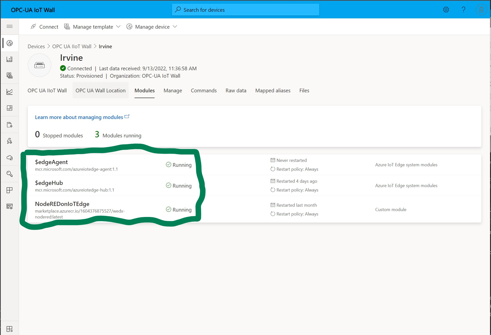

# OPC UA Industrial IoT Wall Setup

I am proud to announce the release of the Next Generation OPC UA IIoT Wall. This document will provide the steps to ensure a successful rollout. I'd like to thank **Ranga Vadlamudi**, from the IoT Central team for his late night and weekend support. I'd like to thank **Hans Gschoßmann** for his insights to the OPC UA integration. A final thank you to **Ali Mazaheri** and **Chad Gronbach** for their time and leadership while I struggled to rebuild the OPC UA wall into an impactful demo and showcase for our customers.

>I want to add a special thank to **Brad Murphy** for his support and persistance! I wouldn't have been able to get this done without his support.

**Please Note:** The OPC UA Wall is an evolving solution and will continue to be improved through the coming weeks and months. I'll be posting a list of roadmap features and showcases that you can leverage for your customer events. If you would like to assist, I'm looking for volunteers. Reach out to me directly.

Kevin Orbaker

## HP Gateway Setup

The HP gateway installed on the OPC wall must be installed/upgraded with the latest version of [Windows 10 IoT Enterprise LTS](https://microsoft.sharepoint.com/:f:/t/MTCIESCommunity/EtlIMAxMDhFDi2K7XVo4c_gBnuWzI-ANKgQYtpHDJUT9CA?e=SPSNcv "Windows 10 IoT Enterprise LTS"). You must do a clean installation. Do not install any unnecessary software.

Once you have done an installation, make sure all updates are completed prior to proceeding with the installation. 

>Note: You might have to run Windows Update multiple times to get all the updates.

After all Windows Updates are applied, run [Disk Cleanup](https://support.microsoft.com/en-us/windows/disk-cleanup-in-windows-8a96ff42-5751-39ad-23d6-434b4d5b9a68) on the C: drive (include system files) to free up space.

### Update Network Settings

>This is a critical step as it must be done prior to the next steps.

The HP Gateway comes with two ethernet ports. Both ports are connected to the same switch, and by default, they both grab an IP Address from whatever DHCP server your wall is connected to. 

One of the ports must be assigned a **static IP address** to one of the ports to ensure it can communicate with the devices that are plugged into the IoT Wall.

#### Assign a Static IP Address

* From Windows, press **Windows + R**. From the Run dialog enter  **control panel** and click **OK**

- From Control Panel select **Network and Internet** and then select **Network and Sharing Center**.
- From there you should see two ethernet connections. Names for these might vary (mine was labeled Ethernet and Ethernet 3). Choose one of the connections and select it.
- From the Ethernet x Status Dialog, click **Properties**
- From the Properties Dialog, click **Internet Protocol Version 4(TCP/IPv4)** and click **Properties**
- From the **Internet Protocol Version 4** dialog, click **Use the following IP address:** and enter the following:
  - IP address: **192.168.30.10**
  - Subnet mask: **255.255.255.0**

> Note: Leave all other values  blank.

- Click **OK** then **Close**

### Install and Provision EFLOW

EFLOW (Edge for Linus on Windows) let's you run Auzure IoT Edge in a Linux container on Windows.

1. In an elevated PowerShell session, run each of the following commands to download IoT Edge for Linux on Windows.

    ```
    Set-ExecutionPolicy -ExecutionPolicy AllSigned -Force
    $msiPath = $([io.Path]::Combine($env:TEMP, 'AzureIoTEdge.msi'))
    $ProgressPreference = 'SilentlyContinue'
    Invoke-WebRequest "https://aka.ms/AzEflowMSI" -OutFile $msiPath
    ```

2. Install IoT Edge for Linux on Windows on your device.

    ```
    Start-Process -Wait msiexec -ArgumentList "/i","$([io.Path]::Combine($env:TEMP, 'AzureIoTEdge.msi'))","/qn"
    ```

  3. Create the IoT Edge for Linux on Windows deployment. The deployment creates your Linux VM and installs the IoT Edge runtime for you.

      ```
      Deploy-Eflow -cpuCount 2 -memoryInMB 4096 -vmDiskSize 20 
      ```

## Onboarding Your OPC UA IIoT Wall

The OPC UA IIoT Wall is hosted on IoT Central in the EXP tenant. To onboard your wall, you will need to do the following.

- Login to the [OPC UA IIoT Portal](https://opc-ua-iot-wall.azureiotcentral.com/devices) with your **Manager, Product Development - Engineering** persona. For example: In Irvine, it is **Aamil Shammas**. Find the Persona for your Location [here](https://exppeople.azurewebsites.net/)
- Select your location from the list.
- From the Device screen, select **Connect** in the upper left corner of the display. You will need the **ID Scope**, **Device ID** and **Primary Key**, to onboard your Wall during the IoT Edge runtime installation in the next step.

   

- Use the ID scope, Device ID and the Primary Key you made a note of previously

    ```
    Provision-EflowVm -provisioningType DpsSymmetricKey -scopeId <ID_SCOPE_HERE> -registrationId <DEVCIE_ID_HERE> -symmKey <PRIMARY_KEY_HERE>
    ```

   > Note: You will likely need to execute the above command two times. Durnig the first execution, you might need to restart, and then execute the above statement again.

Once you have successfully deployed **EFLOW** on your gateway device, it will take a few minutes for IoT Central to push down all the updates. 

> **Note**: Before proceeding with the next steps, wait until you see your Modles showing a status of 'Running' (see screenshot)


## Deploy the Local Node-RED Flow

The final step is to deploy the Node-RED Flow for the Beckhoff Controller. This process will capture and report the Telemetry from the Beckhoff sensors and services (Temperature, Fan Speed, and Lamp Status) as well as process commands from IoT Central (Enable/Disable the Lamp, Set the Fan Speed from 0-32,000 RPM)

- From Microsoft Edge on the HP gateway, navigate to <http://localhost:1880>

>You will be promted to login to Node-RED. Please see the IoT Teams Channel for this information.
>At this point you might be promoted to **Create Project**. Click **Not right now**

- In the upper right-hand corner of the Node-RED canvas there is a *hamburger* menu option (three lines).
- Click on the hamburger menu and select **Manage Palette**
  - Click on the **Install** tab
  - Search for *node-red-contrib-opcua*
  - Click **Install**, and then click **Install** from the pop-up
  - Once complete click **Close**

>This should take less than 1 minute to complete. You will see a pop-up window with the list of nodes that were installed.

- Click on the hamburger menu and select **Import**
- From the **Import nodes** window
  - Select **Clipboard** and copy and paste the following [JSON](flows/beckhoff-flow.json) into the text area in the window and click **Import**

>At this point you might be prompted for another action. If so, click **Import copy**

You should see three tabs across the top of the Node-RED canvas.
Before you continue with the deployment, you will need to delete the two tabs that were created when Node-RED was initialized for the first time. The two tabs are labeled **Azure IoT Edge** and **Dashboard**.

- Double-click on the **Azure IoT Edge** tab
- From the pop-out window, click **Delete**
- Repeat the previous two steps for the **Dashboard** tab
- Finally, click **Deploy** in the upper right-hand corner of the canvas.

## Congratulations

Your OPC UA IIoT wall has been deployed and is ready for use. You should see Beckhoff Telemetry being sent to your wall.

## Contributing

This project welcomes contributions and suggestions.  Most contributions require you to agree to a
Contributor License Agreement (CLA) declaring that you have the right to, and actually do, grant us
the rights to use your contribution. For details, visit <https://cla.opensource.microsoft.com>.

When you submit a pull request, a CLA bot will automatically determine whether you need to provide
a CLA and decorate the PR appropriately (e.g., status check, comment). Simply follow the instructions
provided by the bot. You will only need to do this once across all repos using our CLA.

This project has adopted the [Microsoft Open Source Code of Conduct](https://opensource.microsoft.com/codeofconduct/).
For more information see the [Code of Conduct FAQ](https://opensource.microsoft.com/codeofconduct/faq/) or
contact [opencode@microsoft.com](mailto:opencode@microsoft.com) with any additional questions or comments.

## Trademarks

This project may contain trademarks or logos for projects, products, or services. Authorized use of Microsoft
trademarks or logos is subject to and must follow
[Microsoft's Trademark & Brand Guidelines](https://www.microsoft.com/en-us/legal/intellectualproperty/trademarks/usage/general).
Use of Microsoft trademarks or logos in modified versions of this project must not cause confusion or imply Microsoft sponsorship.
Any use of third-party trademarks or logos are subject to those third-party's policies.
